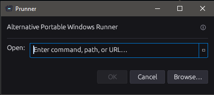

# Prunner — Portable Windows Run

A portable replacement or alternative for the Windows Run dialog (`Win+R`). Single binary, no installer, no runtime dependencies.

## What is it?

Prunner does everything the native Windows Run dialog does — type a command, press Enter, it runs — but with a persistent history, dropdown navigation, admin elevation shortcut, and a cleaner UI that follows your system theme.

More importantly, it works **even when the native Run dialog has been disabled**.

## ⚠️ Disclaimer

This tool is intended for:

- Educational use  
- Authorized security testing  

Do **not** use this tool for unauthorized or malicious activity.

You are responsible for how you use this software.

## Screenshot


## What you can run

- Any executable or system command (`notepad`, `calc`, `cmd`)
- Full paths (`C:\Tools\applications.exe`)
- Folders — opens in Explorer
- Documents — opens with the default associated app
- URLs — `https://...` opens in your default browser
- Environment variable paths (`%APPDATA%\something`, `%USERPROFILE%\...`)

## Why use it instead of Win+R?

| Feature | Win+R | Prunner |
|---|---|---|
| Persistent history across reboots | ❌ | ✅ |
| Dropdown history browser | ❌ | ✅ |
| Run as Administrator shortcut | ❌ | ✅ `Ctrl+Enter` |
| Dark / light mode | ❌ | ✅ Follows system |
| Works when Run dialog is disabled | ❌ | ✅ |
| No install required | ❌ | ✅ Single `.exe` |

## When the Run dialog is disabled

In enterprise and managed environments, IT administrators commonly disable the native Run dialog via Group Policy:

```
User Configuration → Administrative Templates → Start Menu and Taskbar
→ "Remove Run menu from Start Menu" = Enabled
```

This kills `Win+R` entirely. **Prunner sidesteps this** — it is just a `.exe` you double-click. It calls `ShellExecuteW` directly (the same Win32 API Windows itself uses), so it is unaffected by the Run dialog policy.

Other scenarios where Win+R is unavailable but Prunner works:

| Scenario | Notes |
|---|---|
| Group Policy disables Run dialog | Prunner is just an `.exe`, unaffected by the policy |
| Kiosk / locked-down shell | If Explorer is replaced, Win+R may not exist — Prunner still launches |
| Remote Desktop sessions | Win+R behaves inconsistently over RDP; Prunner is self-contained |
| Portable / USB use on foreign machines | No install needed — copy the `.exe` and run it |
| Start Menu disabled or replaced | Pin Prunner to the taskbar or launch it via a desktop shortcut |

> **Note:** If the environment also enforces AppLocker or Software Restriction Policies that block arbitrary executables by path, Prunner itself may be blocked from launching. Placing it in an allowed path (e.g. `C:\Program Files\`) or signing the binary addresses this.

## Features

- **Run anything**: programs, folders, documents, URLs
- **Environment variable expansion**: `%APPDATA%`, `%USERPROFILE%`, etc.
- **Run as Administrator**: `Ctrl+Enter`
- **Smart error messages**: shown inline — the window never crashes or closes on error
- **Persistent history**: last 20 commands, deduplicated, survive reboots
- **History dropdown**: click the `▼` arrow or press `↑`/`↓` to browse
- **Clear history**: available inside the dropdown with a confirmation step
- **Browse button**: opens a native Windows file picker
- **System theme**: reads the Windows registry — follows light/dark mode exactly
- **High-DPI aware**: PerMonitorV2 via application manifest
- **Always on top**: never buried behind other windows
- **No console window** in release builds
- **No installer, no dependencies**: single `.exe`, xcopy-deployable

## Keyboard Shortcuts

| Key | Action |
|-----|--------|
| `Enter` | Run command |
| `Ctrl+Enter` | Run as Administrator |
| `Escape` | Close dropdown / close app |
| `↑` / `↓` | Navigate history (opens dropdown) |

## Security

- **No shell expansion** — commands go directly to `ShellExecuteW`, not through `cmd.exe`. No shell injection surface.
- **No network calls** — zero outbound connections at runtime.
- **Read-only registry access** — only reads `AppsUseLightTheme` for theme detection.
- **No `unwrap()` on user data** — all user input paths use explicit error handling.
- All `unsafe` blocks are Windows FFI calls only (`ShellExecuteW`, `GetOpenFileNameW`, `RegOpenKeyExW`) — each reviewed and bounded correctly.
- Audited against the OSV vulnerability database (266 transitive dependencies, zero findings).

## Building for Windows

```bash
# Release build — optimized, no console window, icon embedded
cargo build --release
# Output: target/release/Prunner.exe

# Cross-compile from Linux
sudo apt install mingw-w64
rustup target add x86_64-pc-windows-gnu
cargo build --release --target x86_64-pc-windows-gnu
```

## History File

Saved to `%USERPROFILE%\.prunner_history.json` on Windows.

## Architecture

```
src/
├── main.rs      — UI, keyboard handling, window positioning, ComboBox
├── executor.rs  — ShellExecuteW, env var expansion, run-as-admin
├── history.rs   — Load/save/push/clear (serde_json)
└── theme.rs     — System light/dark via Windows registry, design tokens
assets/
└── run.ico      — Embedded at compile time via include_bytes!
build.rs         — Windows resource script: icon + DPI-aware manifest
```
